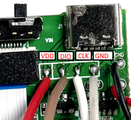

  

 
  

# What is the ELLIPAL Joy - Mnemonic Generator?

​    	ELLIPAL Joy is a device that generates random mnemonic phrases. ELLIPAL Joy strictly follows the [BIP39 standard mnemonic phrase](https://www.ellipal.com/blogs/support/mnemonic-generation) and allows users to generate 12/15/18/21/24-word mnemonic phrases. It is compatible with most hardware wallets and hot wallets on the market, such as Trezor wallet and Trust wallet.

If you are after instructions and firmware for building your own Ellipal-Joy using off-the-shelf components, then you want to use [this repository here](https://github.com/3rdIteration/ellipal-joy/tree/Nucleo)

# Build & burn

1. Build platform: Windows

2. Build tool: [STM32CubeIDE](https://www.st.com/en/development-tools/stm32cubeide.html#get-software)

3. Clone/Download this repository.

4. Launch project: double click `.cproject` file in the project directory

5. Compile source code to generate a hex file: `xxx.hex` (Either Release or Debug releases will work)

6. Disassemble the Ellipal device and solder wires on the SWD terminal as shown below.
 

7. Connect the device to your PC via an STM32 Programmer (Any St-Link v2 Clone will be fine), using the 3.3v, GND, SWDIO and SWCLK pins.

8. Using [STM32 Cube Programmer](https://www.st.com/en/development-tools/stm32cubeprog.html) tool to burn the hex file(*ex: H7B0.hex*) into your device

9. Restart ellipal-joy and enjoy it

# Debugging over RS232
There are TX and RX pads connected to UART1 on the MCU, these are marked on the underside of the main board. Once you solder some wire on to these pads, you can connect to your PC with an FT232L device.

When you build the firmware with the DEBUG environment variable present (Enabled by default), you can then use terminal tools like Putty to view additional debugging information.

# Talk to us

We have active, helpful communities on official website, Twitter, Facebook and Email

- Website: **[https://www.ellipal.com](https://www.ellipal.com/)**
- Twitter: **[https://twitter.com/ellipalwallet](https://twitter.com/ellipalwallet)**
- Facebook: **[https://www.facebook.com/ellipalclub](https://www.facebook.com/ellipalclub)**
- Email: **[CS@ellipal.com](mailto:CS@ellipal.com)**
