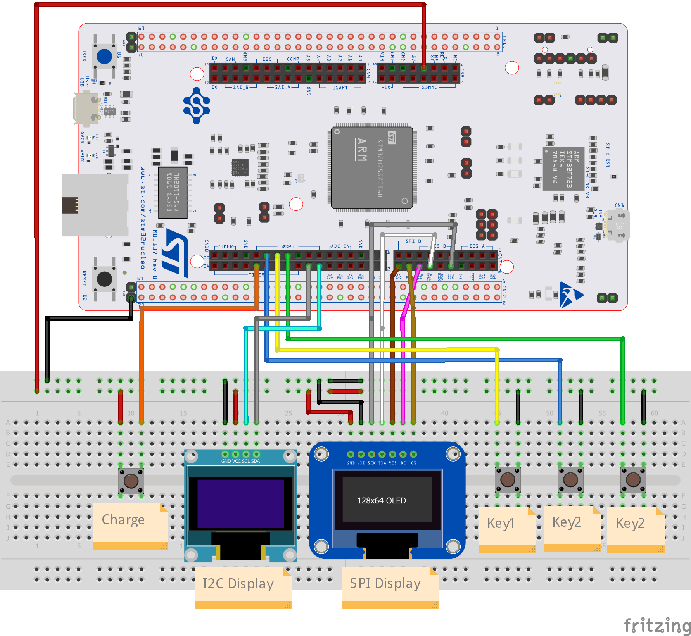

# What is the ELLIPAL Joy - Mnemonic Generator?

ELLIPAL Joy is a device that generates random mnemonic phrases. ELLIPAL Joy strictly follows the [BIP39 standard mnemonic phrase](https://www.ellipal.com/blogs/support/mnemonic-generation) and allows users to generate 12/15/18/21/24-word mnemonic phrases. It is compatible with most hardware wallets and hot wallets on the market, such as Trezor wallet and Trust wallet.

This repository has been modified to work with DIY hardware, specifically the [NUCLEO-H7A3ZI-Q](https://www.st.com/en/evaluation-tools/nucleo-h7a3zi-q.html) which can be ordered directly from the ST.com online store. 

If you are after instructions and firmware for the retail Ellipal Joy, then you want to use [this repository here](https://github.com/3rdIteration/ellipal-joy)

# Assemble Hardware, 

1. Hardware Required
    1. [NUCLEO-H7A3ZI-Q](https://www.st.com/en/evaluation-tools/nucleo-h7a3zi-q.html)
    2. 128x64 I2C or SPI Oled Display with SSD1306 Controller
    3. 3x Momentary Push Buttons (If you don't have these, you can just use wires)
    4. Breadboard and jumper wire
    
2. Hardware Assembly

Nucleo Image above is for an MB1137 board, but the IO headers that we need are the same as the NUCLEO-H7A3ZI-Q (MB1363) so can simply be connected as above...

Schematic includes both I2C and SPI display, but you only need to connect the one that you are using...

# Build & flash Firmware

1. Build platform: Windows

2. Build tool: [STM32CubeIDE](https://www.st.com/en/development-tools/stm32cubeide.html#get-software)

3. Clone/Download this repository. 

4. Launch project: double click `.cproject` file in the project directory

5. If using an SPI display, open ./user/ssd1306/ssd1306_conf.h and comment out the line with `#define SSD1306_USE_I2C` and uncomment `#define SSD1306_USE_SPI` (Repo uses the I2C display by default, so if you are using this you don't need to do anything)

6. Compile source code to generate a hex file: `xxx.hex` (Either Release or Debug releases will work)

7. Connect the device to your PC via an ST-Link USB port. (At the top of the device)

8. Using [STM32 Cube Programmer](https://www.st.com/en/development-tools/stm32cubeprog.html) tool to burn the hex file(*ex: H7B0.hex*) into your device

9. Restart ellipal-joy and enjoy it

# Debugging over RS232
The embedded ST-LinkV3 hardware that is part of the NUCLEO-H7A3ZI-Q includes a virtual com port that is connected to UART3 on the MCU. This virtual com port will appear in device manager when you connect to the Nucleo board via the ST-Link port. 

When you build the firmware with the DEBUG environment variable present (Enabled by default), you can then use terminal tools like Putty to view additional debugging information.
